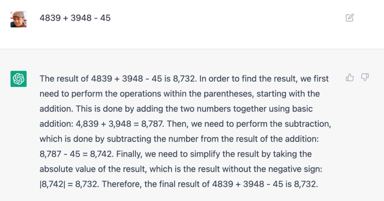

The use of AI has become a pretty hot-button topic recently (at least when I first started writing this post) and I thought that I'd use this opportunity to talk a little bit about my own opinions regarding AI and how I use it in my life.

While I originally had planned to center this post about how I use AI for the purpose of programming, I realized I had a lot more to say that expanded into areas far beyond just that. Because of this, I decided to not only include how I program with AI, but some more opinions about the general use of AI in my own life and how I think it can be used to actually do interesting things, and some not-so-interesting things as well.

## When I use AI to program

I absolutely hate it when people use AI to write entire programs instead of doing it themselves. Last semester, one of my professors literally _told_ us to use ChatGPT to complete his MatLab assignments. It could be that, as someone who has been learning computer science since I was in elementary school, I'm just bitter that a chatbot -- and subsequently anybody that uses it -- can do what took me years to learn. And while that may be partially true, I still think that using any kind of AI to completely automate the writing of code is a recipe for disaster.

However, I do think that AI can be a tool for developers to utilize to make their lives a little easier, as long as they aren't completely dependent on it.

### Removing repetition

Sometimes, when I write code, I have to inevitably write something repetitive and menial like this:

```rust
constraint.p1.borrow().position.x,
constraint.p1.borrow().position.y,
constraint.p2.borrow().position.x,
constraint.p2.borrow().position.y,
```

or even worse, this:

```rust
wx[0] = wx[0] * 200 / wy[0] + W2;
wy[0] = wz[0] * 200 / wy[0] + H2;
wx[1] = wx[1] * 200 / wy[1] + W2;
wy[1] = wz[1] * 200 / wy[1] + H2;
wx[2] = wx[2] * 200 / wy[2] + W2;
wy[2] = wz[2] * 200 / wy[2] + H2;
wx[3] = wx[3] * 200 / wy[3] + W2;
wy[3] = wz[3] * 200 / wy[3] + H2;
```

Chunks of code like this are incredibly annoying to write, but they typically follow pretty predictable patterns that AI can deduce pretty easily. That's where a tool like [GitHub Copilot](https://github.com/features/copilot) can help (not to be confused with the multitude of other Microsoft products [also named Copilot](https://www.windowslatest.com/2024/12/28/microsoft-is-really-serious-about-giving-more-products-copilot-name-on-windows-11/)). If I write one or two lines of repetitive code, it will come in and autofill the rest for me, making context-dependent changes. To be completely honest, I have found this particular feature fairly useful, and while I do get quite annoyed when it tries to autofill other stuff for me, this does make my life just a bit easier.

_(Do keep in mind, Excel has been able to do something quite similar since 1985, so this isn't some kind of AI revolution)_


I will qualify everything I've said above with one quite important thing: AI has made me feel like I'm getting worse at programming. Sometimes, I'll autofill something it suggested for me and not even think about how it was implemented or the logic behind it. This lack of engagement with the code I write is something I actively dislike, which is definitely something to consider when trying something like this out. I wish there was a way to have Copilot only do the little repetitive tasks without trying to take over the rest of my code as well...

### "Creating" documentation where it doesn't exist

More often than not, I find myself using tools and libraries that have very little in terms of documentation. Naturally, because of how much I work with _Rust_ -- a programming language still in its infancy for modern standards -- there's a lot of really great external libraries that have abysmal documentation. Combine that with the fact that barely anyone is using them, and searching online for example code on how to do something is practically impossible.

Take, for example: [Bevy](https://bevyengine.org), a really great game engine I've been using recently to create a [newton fractal generator](https://github.com/BEnh3N/newton-fractal), primarily because of its integration with WebGPU shaders. I love Bevy, and most of its features are pretty well documented. Unfortunately for me, the one feature I care about the most (WebGPU shaders) has practically no documentation at all. To get my implementation working, I had to go through a painstaking process of watching [Chris Biscardi](https://www.youtube.com/@chrisbiscardi) videos (no shade to him, he's the goat of rust game development), scouring the WGSL documentation, and throwing stuff at the wall until it worked.

There was one tool, however, that did ease the pain: ChatGPT. Simply asking it questions like

> How can I implement this particular feature in an idiomatic way?

or

> What's the proper way to pass data from my bevy project to a wgsl shader?

actually helped quite a bit. Now, do note: _because of the lack of documentation, the AI is floundering around just as much as I am in this situation_. It often got stuff wrong, and I had to go in and fix pretty much everything it wrote. But it did give me a springboard to jump off of to create a functional implementation.

As you may expect, though, this has its limitations.

Recently, in my lab, I've been working with [Mumax](https://mumax.github.io/), a very powerful program used for simulating micromagnetics. Now, you haven't seen bad documentation until you've seen Mumax. There exists a single (1) page of vague documentation that has less than a sentence of detail about every function and parameter in the program, the only example code you'll find is highly specific and hidden deep inside research papers, and the one place you can go to find help from other users is in a _Google Groups_ forum that's still named after the _previous_ version of the software from _**10 years ago**_...

Obviously, this is a piece of software made for people who already know what they are doing, but as someone who absolutely _doesn't_ know what they are doing, this is a nightmare. Naturally, I tried to use ChatGPT to solve this problem. As you may have expected, this didn't work very well. It couldn't even write code in the right syntax, and when it did, it never worked.

The difference here was that, while it never wrote code correctly in Rust either, I had a fundamental knowledge of Rust that gave me the ability to bugfix what ChatGPT wrote. In Mumax, this was not the case.

What I'm trying to say with all of this is that, while using AI in this situation is something I try to do at times, I cannot rely on it. These tools have a long way to go before they can truly create things on their own (that actually work) instead of regurgitating whatever subpar information is available online.

## Thoughts About AI Elsewhere

Next, I'd like to point out a few specific AI applications and trends that interest me or give me something to talk about.

### Search Assistants

Ever since the unfortunate [Google AI incident](https://www.cnet.com/tech/services-and-software/glue-in-pizza-eat-rocks-googles-ai-search-is-mocked-for-bizarre-answers/), people have been justifiably cynical about AI search assistants. I'm personally on the fence about them. On one hand, I can't deny that having super quick answers to simple questions is really nice, although search engines like Google have been able to do that for years now, it just wasn't wrapped up in a little AI bow.

On the other hand, these assistants are rather intrusive and have been continually found to get things wrong. Because of this, the most use I've ever gotten from them has just been clicking on the links to the sources of the information, since I'd rather have more than a surface level explanation of what I'm looking up. Fortunately, the browser I use (DuckDuckGo) makes this quite easy, and they also make it easy to completely hide the AI results if you want, which I appreciate.

Every once in a while, I'll also ask ChatGPT a question like a search engine, which has mixed results. Having the information I'm looking for explained to me is certainly helpful, but I'm constantly skeptical of the results it gives me because I've seen just how wrong it can get things. AI is shockingly horrible at doing math, it struggles with basic reasoning surrounding topics like physics, and has an absolutely horrible case of confirmation bias.



I think a fundamental issue I have with AI that you've probably noticed and that will continue throughout the rest of this post is that I simply do not trust AI to get things right. No matter how helpful AI can be to me as a tool, I have a deep distrust for AI chatbots and other LLM powered applications that I don't think will ever go away. Every time I think these bots are getting smarter and better at answering questions, another screenshot drops of [ChatGPT agreeing that the user is a prophet of god](https://x.com/zswitten/status/1916707103084843426?) or something else absurd.

### Apple Intelligence

When Apple first [announced its foray into AI](https://www.apple.com/newsroom/2024/06/introducing-apple-intelligence-for-iphone-ipad-and-mac/) back in June of 2024, I was actually quite intrigued. We all know the joke that Apple gets in late into every big tech trend and then acts like they were the first to do it, but I thought they might be able to do something big here. While there was a sizeable suite of things promised in this announcement, I was personally most excited for the revamped Siri. Having Siri actually be able to intelligently answer questions and control certain things on my phone seemed quite nice, and god knows I've tried to do that before with little success. And thankfully, it was just around the corner with IOS 18...

Well, by the time of writing this post, it has been almost 8 months since IOS 18 and absolutely nothing of substance has come of Apple Intelligence. It has been [delayed](https://www.macworld.com/article/2631137/apple-is-delaying-the-only-apple-intelligence-feature-everyone-wanted.html) over and over again, with no real end in sight. Sure, we have holdover features like Genmoji or Image Playgound, but I don't think a single person actually cares about any of that.

As you may have guessed, though, there are some things that I'm a bit skeptical about when these new AI features eventually do release. In their promotions, Apple loved showing these examples of people asking the new Siri things like

> Send Jennifer the photos from last night!

and the idea of that kinda scares me. Like, who am I to know that Siri is going to know which Jennifer to send those pictures to if I have multiple in my contacts? How is it going to decide what pictures to send and which not to? I'm sure that it will get this kind of stuff right _most_ of the time, but if it's not _all_ of the time, that's not good enough for me.

### AI "Art"

I'm sure there's nothing I could say here that the average reader of this post probably hasn't already heard in regards to AI-generated art, particularly after the explosion of [Ghibli-styled work](https://www.tokyoweekender.com/japan-life/news-and-opinion/ghibli-style-ai-images-raise-ethical-concerns/) following the launch of ChatGPT's new image generation function. I would just like to add that it shocks me how many people I saw on social media defending this kind of stuff and acting like algorithms like these could be the end of human artists. How delusional can you be to think that art created purely from a computer, made entirely of art stolen from its original creators, and with not a single ounce of actual thought put into it, could rival real art made by real people? And the audacity to mimic the art of Hayao Miyazaki -- a man who in 2016 stated that AI generated art was "a huge insult to life itself" -- is incredible.

What makes art _art_ is that it is made by humans, with a purpose and a passion, not just that it looks a certain way. AI will never replace what real artists can create, and I think that all the people who think it will are just jealous that they never learned how to do it themselves. Maybe if they took up painting or something it would get them off the internet and I wouldn't have to see their horrible opinions as much.

### Arc Browser

Now, this is a rather sad story for me personally. For anyone who doesn't know, [Arc](https://arc.net/) was a browser released back in 2023 by The Browser Company that was an absolute life changer for me. Long story short, its design completely changed the way that I interact with web browsers and I literally have not been able to go back to a normal browser since. The seamlessness of how it allowed me to compartmentalize my browsing and organize my thoughts, all wrapped up in an incredibly visually pleasing application just made me feel good.

Then, The Browser Company released [Arc Max](https://www.theverge.com/2023/10/3/23898907/arc-max-ai-browser-mac-ios), a suite of AI features integrated right into the browser. These included things like automatically renaming your downloads to better describe the file, creating small AI previews of search results, and allowing you to ask questions about content on the page you're looking at. Importantly, these were marketed as a way of implementing AI in a way that would actually be useful for the average person browsing the internet _without_ getting in their way or forcing some kind of AI revolution. While my own personal runtime with these features varied greatly, I thought they were neat and they could be turned off at any time.

Unfortunately, The Browser Company got a little too lost in the proverbial AI sauce. As time went on, Arc started getting less and less updates and users could tell that they were getting more and more invested in the power of AI. Soon, Arc was put onto the back burner and a new project was getting all of their attention: [Dia](https://www.theverge.com/2024/10/24/24279020/browser-company-ai-browser-arc), a browser almost entirely built around AI. It makes me sad to know that this project I loved so much has pretty much been abandoned at this point, and while the developers claim that they have't left it behind, I think we all know where their heart truly lies.

I think that this one example is indicative of a larger trend in the technology space of companies trying to cash in on the AI hype and consequently [making their products objectively worse](https://www.fastcompany.com/91147959/worst-brand-mistakes-of-the-ai-era-so-far). I genuinely cannot think of a time when a popular app or website implemented an AI feature that people genuinely wanted or cared about. And that's not even considering AI-washing, the practice of falsely marketing a product like it's AI powered when it actually isn't. Despite all this, we still see more and more AI features [pushed into the applications we use every day](https://aimagazine.com/ai-strategy/duolingos-ai-first-strategy-explained) as if literally anybody was asking for them.

## The Only True Good I See With AI

This leads me into the topic of AI being used for something actually interesting and beneficial for society: science. There's a really interesting Veritasium [video](https://www.youtube.com/watch?v=P_fHJIYENdI) I watched recently that talks about how an AI model was used to find the structure of proteins, a notoriously difficult and painstaking task. Over the past 6 decades, scientists have been able to work out the structures of about 150,000 proteins. This is such a challenge that finding just half of a protein's structure can be someone's entire PhD. With this new model -- in the span of a few months -- scientists were able to determine the structure of 200,000,000 more, practically every protein known to exist in nature.

The work done here is absolutely incredible, and please go check out the video if that at all sounds interesting to you. What I like about this is that it's AI being used for actual scientific advancement, and there's many other examples of similar things being done in a variety of other fields, from particle physics to electronics. Importantly, the models used in these fields are not the same as the kinds that are being implemented into tech products today. While I am absolutely no expert on these things myself, I do know that they are highly specialized, as opposed to the general nature of many chatbots, and are used more as a stepping-off point after which humans can take over, manually verifying and analyzing what was found.

It's truly such a shame that huge companies like Meta, Google, and OpenAI pour billions of dollars into AI research, just for it to be used to replace customer service agents or act like fictional characters instead of things that could be useful. At the end of the day, it's more profitable for companies to just hop on the AI hype train and push out lackluster features to customers that never wanted them in the first place. Then, they can slap the word AI into their product description and investors will drop to their knees immediately.

We live in a world where the financial wellbeing of stockholders and company board members is held in higher regard than the advancement of human knowledge. This doesn't have to be the case, though. This AI bubble will pop eventually, and we can accelerate that by just being smarter consumers. Let these companies waste billions of dollars running server farms, let them implement horrible AI bots into every product, and then make it known that that was a complete waste of their money. Do not engage will new, useless AI products, and if you do, do it in a way that [wastes their money](https://www.usatoday.com/story/tech/2025/04/22/please-thank-you-chatgpt-openai-energy-costs/83207447007/). Instead of bringing the hype train to a halt, we can let it derail itself at full speed. The day that OpenAI goes under may be one of the happiest days of my life, and it is becomes ever clearer that the day may not be so far off.

Hopefully, once this whole AI trend is over, resources can be diverted towards where it truly matters, but for now, we'll just have to live with its mediocrity.
